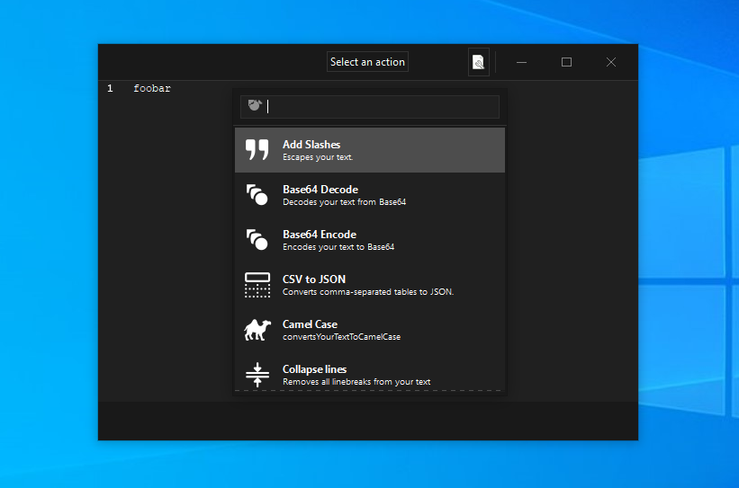

<p align="center">
  <a href="https://youtu.be/WXDTsJ4cqO4"></a>
</p>

</br>

<div align="center">
  
</div>

<h2 align="center">A scriptable scratchpad for developers</h2>
<p align="center">Port of <a href="https://github.com/IvanMathy"><b>@IvanMathy</b></a>'s <a href="https://github.com/IvanMathy/Boop">Boop</a> to GTK</p>


[](https://crates.io/crates/boop-gtk)
[](https://snapcraft.io/boop-gtk)
[](https://flathub.org/apps/details/uk.co.mrbenshef.Boop-GTK)

### What is Boop-GTK?

[Boop](https://github.com/IvanMathy) is a simple editor that allows you to execute scripts on the buffer. The idea is that you don’t have to paste potentially secret information into shady websites to do some simple transforms, like format json and decoding query strings.

Boop-GTK is a port of Boop to GTK, so users on Linux and Windows can Boop it!

### Features

- 50+ builtin scripts including "Base64 Encode", "Format JSON", "Hex to RGB" and more
- 100% script compatibility with [Boop](https://github.com/IvanMathy/Boop)
- Completely crossplatform!

### Screenshots

| Linux | Windows |
| :---: | :---: |
|  |  |

There is also a quick demo on [youtube](https://youtu.be/WXDTsJ4cqO4).

### Get Boop-GTK

<table width="100%">
  <tr>
    <th width="33.333%">Linux</th>
    <th width="33.333%">Windows</th>
    <th width="33.333%">MacOS</th>
  </tr>
  <tr>
    <td>
      <a href="https://github.com/mrbenshef/Boop-GTK/releases/latest/download/boop-gtk.linux.amd64">boop-gtk.linux.amd64</a>
      </br>
      <a href="https://github.com/mrbenshef/Boop-GTK/releases/latest/download/boop-gtk.flatpak">boop-gtk.flatpak</a>
      </br>
      <a href="https://github.com/mrbenshef/Boop-GTK/releases/latest/download/boop-gtk.snap">boop-gtk.snap</a>
      </br>
      <a href="https://snapcraft.io/boop-gtk"></a>
      </br>
      <a href="https://flathub.org/apps/details/uk.co.mrbenshef.Boop-GTK"></a>
    </td>
    <td>
      <a href="https://github.com/mrbenshef/Boop-GTK/releases/latest/download/boop-gtk.windows.msi">boop-gtk.windows.msi</a>
    </td>
    <td>
      You should really use <a href="https://github.com/IvanMathy/Boop">Boop</a>, 
      </br>
      </br>
      but if you <i>really</i> want to:
      </br>
      <a href="https://github.com/mrbenshef/Boop-GTK/releases/latest/download/boop-gtk.macos">boop-gtk.macos</a>
    </td>
  </tr>
</table>

### Building

#### Linux

```shell
sudo apt-get install -y libgtk-3-dev libgtksourceview-3.0-dev
cargo build
```

#### Linux Snap

```shell
sudo apt-get install snap snapcraft
snapcraft snap
sudo snap install boop-gtk_1.2.0_amd64.snap
```

#### Linux Flatpak

```shell
sudo add-apt-repository ppa:alexlarsson/flatpak 
sudo apt-get update 
sudo apt-get install flatpak
sudo flatpak remote-add --if-not-exists flathub https://dl.flathub.org/repo/flathub.flatpakrepo
sudo flatpak install -y flathub org.freedesktop.Platform//19.08 org.freedesktop.Sdk//19.08 org.freedesktop.Sdk.Extension.rust-stable//19.08
wget https://github.com/flatpak/flatpak-builder/releases/download/1.0.10/flatpak-builder-1.0.10.tar.xz && tar -xvf flatpak-builder-1.0.10.tar.xz && cd flatpak-builder-1.0.10 && ./configure --disable-documentation && make && sudo make install
sudo apt-get install python3-toml
bash flatpak/gen-sources.sh
flatpak-builder --repo=repo build-dir flatpak/uk.co.mrbenshef.Boop-GTK.json
flatpak build-bundle ./repo boop-gtk.flatpak uk.co.mrbenshef.Boop-GTK
```

#### MacOS

```shell
brew install gtk+3 gtksourceview3
cargo build
```

#### Windows

I don't really understand why sourceview isn't picked up automatically by system-deps but [if you are curious](https://github.com/gdesmott/system-deps/issues/10).

```powershell
git clone https://github.com/wingtk/gvsbuild.git C:\gtk-build\github\gvsbuild
cd C:\gtk-build\github\gvsbuild; python .\build.py build -p=x64 --vs-ver=16 --msys-dir=C:\msys64 -k --enable-gi --py-wheel --py-egg gtk3 gdk-pixbuf gtksourceview3
${Env:GTKSOURCEVIEW_3.0_NO_PKG_CONFIG}=1; ${Env:SYSTEM_DEPS_GTKSOURCEVIEW_3.0_LIB}="gtksourceview-3.0"; cargo build
```

#### Windows Installer

```powershell
# follow build steps above, then:
cargo install cargo-wix 
${Env:GTKSOURCEVIEW_3.0_NO_PKG_CONFIG}=1; ${Env:SYSTEM_DEPS_GTKSOURCEVIEW_3.0_LIB}="gtksourceview-3.0"; cargo wix -v
```
