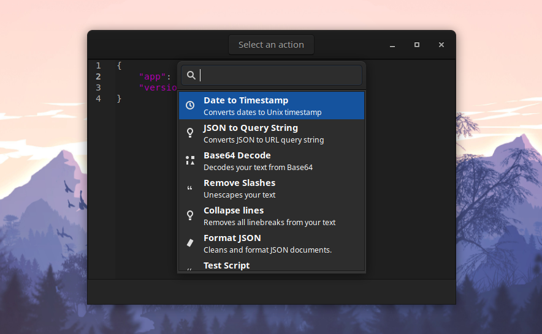

<p align="center">
  <a href="https://youtu.be/WXDTsJ4cqO4"></a>
</p>

</br>

<div align="center">
  
</div>

<h1 align="center">Boop-GTK</h1>
<h3 align="center">A scriptable scratchpad for developers. Port of <a href="https://github.com/IvanMathy"><b>@IvanMathy</b></a>'s <a href="https://github.com/IvanMathy/Boop">Boop</a> to GTK</h3>
<p align="center"><i>Also checkout <a href="https://github.com/zoeyfyi/TeX-Match">TeX Match</a>: Find LaTeX symbols by sketching</i></p>


<p align="center">
  <a href="#what-is-boop-gtk">What is Boop-GTK?</a> • <a href="#features">Features</a> • <a href="#downloads">Downloads</a> • <a href="#screenshots">Screenshots</a> • <a href="#usage">Usage</a> • <a href="#additional-scripts">Additional Scripts</a> • <a href="#building">Building</a>
</p>


</br>


[](https://crates.io/crates/boop-gtk)
[](https://snapcraft.io/boop-gtk)
[](https://flathub.org/apps/details/fyi.zoey.Boop-GTK)


### What is Boop-GTK?

[Boop](https://github.com/IvanMathy) is a simple editor that allows you to execute scripts on the buffer. The idea is that you don’t have to paste potentially secret information into shady websites to do some simple transforms, like format json and decoding query strings.

Boop-GTK is a port of Boop to GTK, so users on Linux can Boop it!

### Features

- 50+ builtin scripts including "Base64 Encode", "Format JSON", "Hex to RGB" and more
- 100% script compatibility with [Boop](https://github.com/IvanMathy/Boop)
- Completely crossplatform!

### Downloads

| Platform | Format | Link | 
| -------- | ------ | ---- | 
| Linux | Binary | [boop-gtk.linux.amd64](https://github.com/zoeyfyi/Boop-GTK/releases/latest/download/boop-gtk.linux.amd64) | 
| | Flatpak | [boop-gtk.flatpak](https://github.com/zoeyfyi/Boop-GTK/releases/latest/download/boop-gtk.flatpak) | 
| | Snap | [boop-gtk.snap](https://github.com/zoeyfyi/Boop-GTK/releases/latest/download/boop-gtk.snap) | 
| | AUR | [`boop-gtk`](https://aur.archlinux.org/packages/boop-gtk/) (thanks to qcasey) </br> [`boop-gtk-bin`](https://aur.archlinux.org/packages/boop-gtk-bin/) </br>  [`boop-gtk-extra-scripts`](https://aur.archlinux.org/packages/boop-gtk-extra-scripts/) | 
| | Snap Store | [](https://snapcraft.io/boop-gtk) | 
| | Flathub | [](https://flathub.org/apps/details/fyi.zoey.Boop-GTK) | 

If you are looking for a Windows version check out [Woop](https://github.com/felixse/Woop) by @felixse. For MacOS check out [Boop](https://github.com/IvanMathy/Boop) by @IvanMathy, the project from which this is based.

### Screenshots



There is also a quick demo on [youtube](https://youtu.be/WXDTsJ4cqO4).

### Usage

More documentation can be found in [Boop's docs](https://github.com/IvanMathy/Boop/blob/main/Boop/Documentation/Readme.md).

Boop-GTK is easy to use: open it, paste some text, run some scripts, optionally copy the text out.

- [Custom Scripts](https://github.com/IvanMathy/Boop/blob/main/Boop/Documentation/CustomScripts.md)
- [Modules](https://github.com/IvanMathy/Boop/blob/main/Boop/Documentation/Modules.md)
- [Converting Node Modules](https://github.com/IvanMathy/Boop/blob/main/Boop/Documentation/ConvertingNodeModules.md)
- [Global Scripts](docs/GlobalScripts.md) (unique to Boop-GTK)

### Additional Scripts

More scripts can be found in the [Boop repo](https://github.com/IvanMathy/Boop/tree/main/Scripts). These scripts can also be found in the <a href="https://aur.archlinux.org/packages/boop-gtk-extra-scripts/"><code>boop-gtk-extra-scripts</code></a> package on the AUR.

### Building

#### Binary

```shell
sudo apt-get install -y libgtk-3-dev libgtksourceview-3.0-dev
cargo build
```

#### Snap

```shell
sudo apt-get install snap snapcraft
snapcraft snap
sudo snap install boop-gtk_1.7.1_amd64.snap
```

#### Flatpak

```shell
sudo add-apt-repository ppa:alexlarsson/flatpak 
sudo apt-get update 
sudo apt-get install flatpak
sudo flatpak remote-add --if-not-exists flathub https://dl.flathub.org/repo/flathub.flatpakrepo
sudo flatpak install -y flathub org.freedesktop.Platform//20.08 org.freedesktop.Sdk//20.08 org.freedesktop.Sdk.Extension.rust-stable//20.08
wget https://github.com/flatpak/flatpak-builder/releases/download/1.0.10/flatpak-builder-1.0.10.tar.xz && tar -xvf flatpak-builder-1.0.10.tar.xz && cd flatpak-builder-1.0.10 && ./configure --disable-documentation && make && sudo make install
sudo apt-get install python3-toml
bash flatpak/gen-sources.sh
flatpak-builder --repo=repo build-dir flatpak/fyi.zoey.Boop-GTK.json
flatpak build-bundle ./repo boop-gtk.flatpak fyi.zoey.Boop-GTK
```

